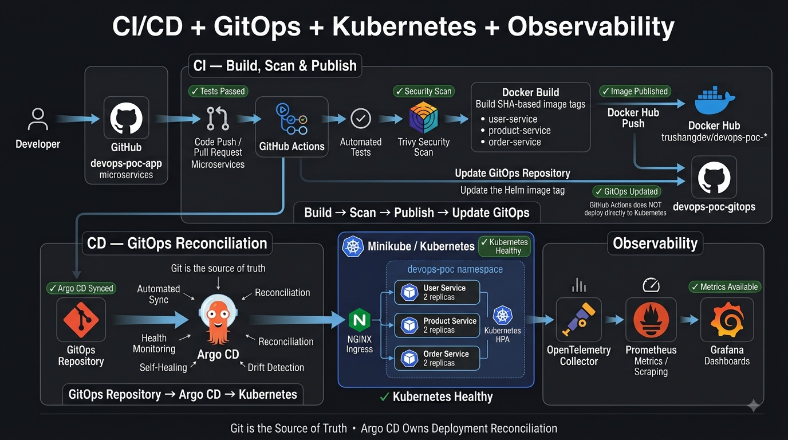

# DevOps Microservices POC — Application

A local, end-to-end **DevOps + DevSecOps + GitOps** proof of concept: three Node.js microservices, containerized, security-scanned, continuously delivered through GitHub Actions and Docker Hub, and deployed to Kubernetes via a companion GitOps repository and Argo CD.

This repository holds the **application source**. Everything else — Kubernetes manifests, Helm charts, Argo CD config, and the observability stack — lives in [`devops-poc-gitops`](https://github.com/trushang-dev/devops-poc-gitops).



## What this demonstrates

- Three independent Express microservices with health checks, Prometheus metrics, and unit tests
- Multi-stage Docker builds, one image per service
- A GitHub Actions pipeline: test → filesystem security scan (Trivy) → image build → image security scan → publish to Docker Hub
- A release-branch promotion model, so only reviewed, versioned code ever produces a deployable image
- An automated handoff to the GitOps repository — CI never touches Kubernetes directly

## Repository relationship

```text
devops-poc-app                devops-poc-gitops
  (this repo)                  (companion repo)

  services/*      ──build──▶  GitHub Actions
                                    │
                              test → scan → build
                                    │
                              Docker Hub push
                                    │
                        update helm/microservices/values.yaml
                                    │
                                    ▼
                          devops-poc-gitops (Git)
                                    │
                                 Argo CD
                                    │
                                Kubernetes
```

`devops-poc-app` never deploys anything itself — it produces a versioned, scanned image and hands off to Git. See the [devops-poc-gitops docs](https://github.com/trushang-dev/devops-poc-gitops/tree/main/docs) for the deployment side of the pipeline.

## Services

| Service | Port | Business endpoint | Health | Metrics |
|---|---:|---|---|---|
| user-service | 3001 | `GET /users` (+ `GET /version`) | `GET /health` | `GET /metrics` |
| product-service | 3002 | `GET /products` | `GET /health` | `GET /metrics` |
| order-service | 3003 | `GET /orders` | `GET /health` | `GET /metrics` |

Each service is a self-contained Express app with an in-memory dataset (no database dependency), structured logging, and Prometheus instrumentation (`prom-client`) including HTTP request latency histograms. Unknown routes return a JSON 404; unexpected errors return a JSON 500.

```text
devops-poc-app/
├── services/
│   ├── user-service/
│   ├── product-service/
│   └── order-service/
├── docs/
│   └── architecture.png
├── docker-compose.yml
└── .github/workflows/ci.yml
```

## Running locally

### Node.js directly

```bash
cd services/user-service && npm install && npm start   # or: npm run dev
```

`PORT` is configurable via environment variable and defaults to the port listed above. Repeat for `product-service` and `order-service`.

```bash
curl http://localhost:3001/health
curl http://localhost:3001/users
curl http://localhost:3001/metrics
```

### Docker Compose (all three services)

```bash
docker compose up --build -d
curl http://localhost:3001/health
curl http://localhost:3002/health
curl http://localhost:3003/health
docker compose down
```

### Tests

```bash
cd services/user-service && npm test
```

## CI/CD pipeline

Defined in [`.github/workflows/ci.yml`](.github/workflows/ci.yml):

```text
Push / Pull Request (develop)
        │
        ▼
   npm test
        │
        ▼
Trivy filesystem scan  (full report, then a CRITICAL-only gate)
        │
        ▼  ── only on a push to release/* ──
        ▼
  Docker image build   (tagged with SemVer + commit SHA)
        │
        ▼
Trivy image scan       (full report, then a CRITICAL-only gate)
        │
        ▼
   Docker Hub push
        │
        ▼
Update devops-poc-gitops (bump Helm image tag, commit, push)
```

Every service builds independently via a matrix job. Feature and `develop` pushes are validation-only (tests + filesystem scan); only a push to a `release/*` branch builds, scans, and publishes an image and updates the GitOps repository. GitHub Actions never runs `kubectl` or touches the cluster — Argo CD owns deployment.

## Git workflow

```text
feature/*  →  develop  →  release/*  →  main
```

- `feature/*` — short-lived branches for new work
- `develop` — integration branch
- `release/*` — stabilization branch that CI promotes to a Docker Hub image + GitOps update
- `main` — released code

## Design principles

- No secrets committed to source or baked into images — configuration comes from environment variables and Kubernetes Secrets (see the GitOps repo)
- Every published image is immutably versioned (SemVer + commit SHA); `latest` is never used as a deployment tag
- CI's blast radius stops at "can push a Git commit" — it has no cluster credentials

## License

MIT — see [LICENSE](LICENSE).
